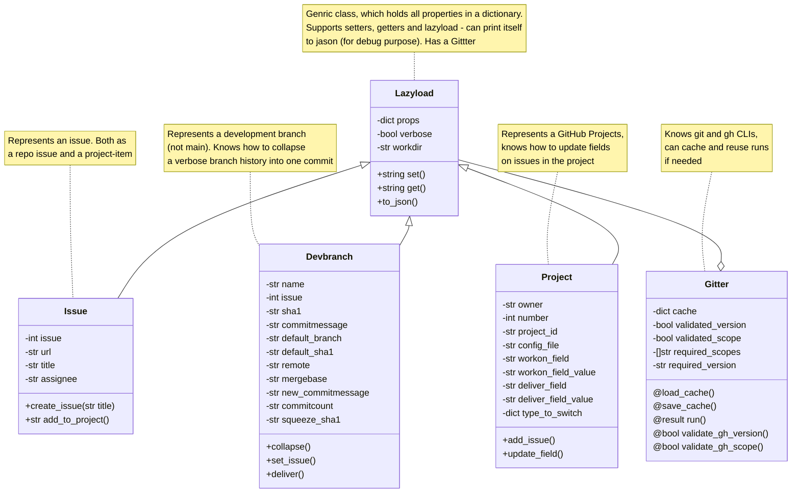

> [!NOTE]  
>This class diagram was used as a help during development. It's not entirely a true to the actual implementation.

```mermaid
classDiagram
    Lazyload <|-- Issue
    Lazyload <|-- Devbranch
    Lazyload <|-- Project
    Lazyload --o Gitter


    class Gitter{
        -dict cache
        -bool validated_version
        -bool validated_scope
        -[]str required_scopes
        -str required_version      
        @load_cache()
        @save_cache()
        @result run()
        @bool validate_gh_version()
        @bool validate_gh_scope()
    }
    note for Gitter "Knows git and gh CLIs,
      can cache and reuse runs 
      if needed"

    class Lazyload {
        -dict props
        -bool verbose
        -str workdir
        +string set()
        +string get()
        +to_json()
    }
    note for Lazyload "Genric class, which holds all properties in a dictionary. 
    Supports setters, getters and lazyload - can print itself
    to jason (for debug purpose). Has a Gittter"

    class Issue{
      -int issue
      -str url
      -str title
      -str assignee
      +create_issue(str title)
      +str add_to_project()
    }
    note for Issue "Represents an issue. Both as 
      a repo issue and a project-item"

    class Devbranch{
      -str name   
      -int issue
      -str sha1
      -str commitmessage

      -str default_branch
      -str default_sha1
      -str remote
      -str mergebase
      -str new_commitmessage
      -str commitcount
      -str squeeze_sha1

      +collapse()
      +set_issue()
      +deliver()
    }
    note for Devbranch "Represents a development branch 
      (not main). Knows how to collapse 
      a verbose branch history into one commit"

    class Project{
      -str owner
      -int number
      -str project_id

      -str config_file
      -str workon_field
      -str workon_field_value
      -str deliver_field
      -str deliver_field_value

      -dict type_to_switch
      +add_issue()
      +update_field()
    }
    note for Project "Represents a GitHub Projects, 
    knows how to update fields 
    on issues in the project"
```