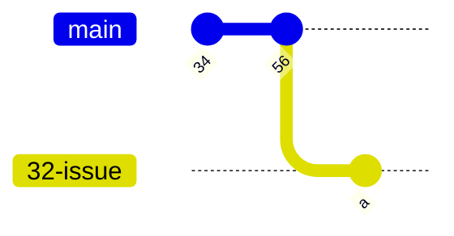
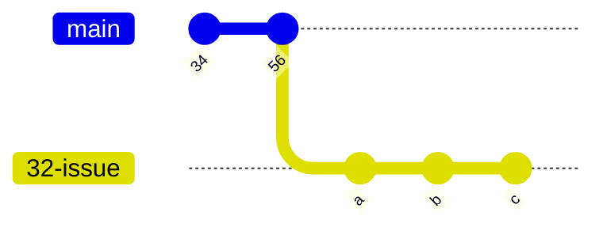

# A new perspective

### Core concept: Issue branch
We work _issue_ branches defined as follows:

- [x] Must come off of `main`
- [x] Must have the issue number it relates to as the first part of the name followed by a dash an then the title of the issue (whitespaces replaced by underscores)

### Workon
When an issue is worked on 

- [x] An existing branch that matches the definition of an _issue branch_ must be reused if it exists either locally or remote
- [x] or else created
- [x] Must be registered with the issue as a _development branch_ (`gh issue develop ...`) (implies being made made available to `origin` immediately upon creation)
- [x] Must have it's upstream set to a branch with the same name in `origin`

If the repo is connected to a kanban board:

- [x] The issue must be added to the project if it isn't already
- [x] The issue must be updated to status 'work in progress'
- [x] The person who began working on the issue must be assigned to the issue

During development the developer can share the branch with co-workers (`workon`, `pull`, `push`) and create as many commits as desired

